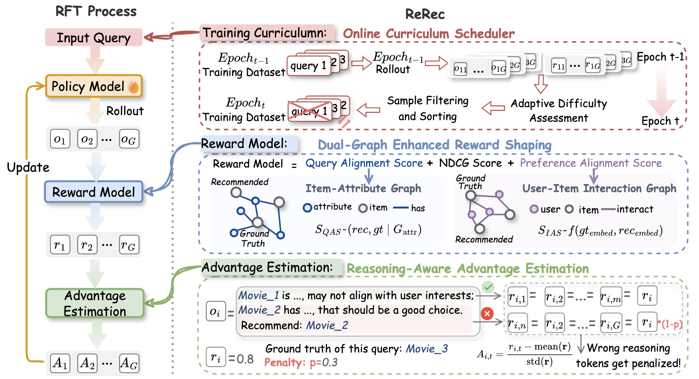

# ReRec: Reasoning-Enhanced LLM-based Recommendation via Reinforcement Fine-tuning

> 📄 **Accepted at ACL 2026** — [[Paper]](https://arxiv.org/abs/2604.07851)

ReRec is a training framework for building reasoning-augmented LLM-based recommendation assistants for complex, real-world queries. Under the Reinforcement Fine-tuning (RFT) paradigm, ReRec tailors reward signals and advantage estimation to recommendation goals, and proposes an online curriculum scheduler for training stability and efficiency.

**Key contributions:**

- **Dual-Graph Enhanced Reward Shaping**: Integrates recommendation accuracy (NDCG@1) with Query Alignment Score (QAS) and Item Alignment Score (IAS) via item-attribute bipartite graphs to provide fine-grained, multi-source rewards.
- **Reasoning-Aware Advantage Estimation (RAEE)**: Performs token-level reward decomposition — penalizes reasoning steps that lead to incorrect recommendations, improving reasoning quality.
- **Online Curriculum Scheduler**: Dynamically measures per-sample difficulty (d(x) = 1 − NDCG@1) and filters easy samples to guide the policy from easy to hard examples.




## Installation

**Requirements:** Linux · NVIDIA GPU (CUDA ≥ 12.4, cuDNN ≥ 9.8.0) · Python 3.10

```bash
conda create -n rerec python==3.10 -y
conda activate rerec
pip install --no-deps -e .
```


## Data Preparation

Training and evaluation use Parquet files with `prompt` and `reward_model` columns:

```
data/book_train.parquet
data/book_test.parquet
data/movie_train.parquet
data/movie_test.parquet
```

Item-attribute graphs for the Dual-Graph reward:
```
data/book_item_attribute_graph.gexf
data/movie_item_attribute_graph.gexf
```


## Training

ReRec uses [Hydra](https://hydra.cc/) configs with Ray/FSDP backend.

**Quick start** — edit `scripts/train.sh` (set model path, W&B credentials, etc.), then run:

```bash
bash scripts/train.sh
```

**Minimal equivalent command:**

```bash
python -m verl.trainer.main_ppo \
  data.train_files=data/book_train.parquet \
  data.val_files=data/book_test.parquet \
  actor_rollout_ref.model.path=models/Qwen2.5-3B-Instruct \
  actor_rollout_ref.rollout.name=vllm \
  trainer.project_name=YourProject \
  trainer.experiment_name=YourExp \
  trainer.n_gpus_per_node=2 \
  trainer.nnodes=1
```

**Key config overrides** (see `scripts/train.sh` for full defaults):

| Override | Effect |
|---|---|
| `algorithm.adv_estimator=raee` | Enable RAEE token-level advantage estimation |
| `reward_model.reward_manager=raee` | Use RAEE reward manager |
| `custom_reward_function.dual_graph_enhanced=True` | Enable QAS + IAS dual-graph rewards |
| `trainer.curriculum_learning.enable=True` | Enable Online Curriculum Scheduler |

**W&B logging:** export `WANDB_API_KEY` and `WANDB_ENTITY` before running.

### Dual-Graph Reward Services

When `dual_graph_enhanced=True`, QAS and IAS are computed via local FastAPI services. Start them before training:

```bash
# QAS service (Query Alignment Score, port 8000)
python verl/utils/reward_score/qas_service.py --dataset book --port 8000

# IAS service (Item Alignment Score) uses the same service on port 9000
python verl/utils/reward_score/qas_service.py --dataset book --port 9000
```


## Merging & Exporting Checkpoints (FSDP/Megatron → HF)

Checkpoints from FSDP or Megatron backends are sharded. Merge them into a HuggingFace-compatible directory before inference:

```bash
# FSDP
python scripts/model_merger.py merge \
  --backend fsdp \
  --local_dir checkpoints/.../global_step_xxx/actor \
  --target_dir models/your_hf_model

# Megatron
python scripts/model_merger.py merge \
  --backend megatron --tie-word-embedding \
  --local_dir checkpoints/.../global_step_xxx/actor \
  --target_dir models/your_hf_model
```


## Inference

Run batch inference with vLLM on a merged HF model:

```bash
python scripts/predict.py \
  --model_path models/your_hf_model \
  --data_path data/movie_test.parquet \
  --output_path predictions/preds.json \
  --batch_dir predictions/batches \
  --max_tokens 2048 --batch_size 1024 \
  --include_prompts --clean_batch_files
```

The script saves per-batch JSON files incrementally and merges them into a single output file at the end.


## Evaluation

Evaluate predictions with NDCG@10 (and other metrics):

```bash
python scripts/eval.py --pred_path predictions/preds.json
```

The prediction file must contain a `prediction` column; `reward_model.ground_truth` is used as the reference label.


## Project Structure

```
ReRec/
├── scripts/
│   ├── train.sh                  # Training launcher (Hydra overrides)
│   ├── predict.py                # vLLM batch inference
│   ├── eval.py                   # Offline evaluation (NDCG@K, etc.)
│   └── model_merger.py           # Merge sharded checkpoints (FSDP/Megatron → HF)
├── verl/
│   ├── trainer/
│   │   ├── main_ppo.py           # RFT main entry (Ray + FSDP/Megatron + vLLM/SGLang)
│   │   └── config/*.yaml         # Default Hydra configs
│   ├── utils/
│   │   ├── dataset/
│   │   │   └── rl_dataset.py     # RFT data pipeline (chat templates, padding, SP)
│   │   └── reward_score/
│   │       ├── rec.py            # Recommendation rewards (NDCG@K, format, QAS, IAS)
│   │       ├── rec_token.py      # Token-level reward scoring for RAEE
│   │       └── qas_service.py    # FastAPI service for QAS/IAS computation
│   └── workers/
│       ├── reward_manager/
│       │   ├── naive.py          # Standard last-token reward assignment
│       │   └── raae.py           # RAEE token-level reward distribution
│       └── rollout/
│           ├── vllm_rollout/     # vLLM rollout integration
│           └── sglang_rollout/   # SGLang rollout integration
└── data/
    ├── *.parquet                 # Train/test datasets
    └── *_item_attribute_graph.gexf  # Item-attribute graphs for dual-graph reward
```


## FAQ

**Out of memory / CUDA OOM**
- Reduce `actor_rollout_ref.actor.ppo_micro_batch_size_per_gpu`
- Enable `actor_rollout_ref.model.enable_gradient_checkpointing=True` and `actor_rollout_ref.model.use_remove_padding=True`

**Ray stalls / insufficient CPU**
- Add `ray_init.num_cpus=<N>` or reduce parallelism / batch size

**vLLM version conflicts**
- Use pinned versions from `scripts/install_vllm_sglang_mcore.sh`; align `flash-attn` / `flashinfer` versions accordingly

**W&B logging issues**
- Ensure `WANDB_API_KEY` and `WANDB_ENTITY` are exported before running `train.sh`
