# TRACE-Rec Paper Blueprint

> Status note (`2026-04-22`): parts of this blueprint assume explicit rationale generation and teacher-trace training.
> The current authoritative framing is [2026-04-22-framing-update.md](2026-04-22-framing-update.md), which pivots the main story toward answer-only policy inference plus a structure-aware verifier/reward model.

Date: `2026-04-20`

## 🎯 Executive Decision

The recommended primary paper is:

`typed, evidence-grounded, candidate-conditioned structured reasoning for generative next-item recommendation`

This is the safest submission path because it stays close enough to the original idea to be interesting, but avoids the most direct collisions with graph-of-thought or generic structured-CoT papers in recommendation.[^1][^2]

The recommended paper should **not** be framed as:

- the first graph/tree CoT for recommendation
- the first structured CoT for recommendation
- a generic recommendation reasoning framework

The recommended paper **should** be framed as:

- a recommendation-specific reasoning structure with typed nodes and explicit evidence grounding
- a model that jointly optimizes recommendation quality and reasoning faithfulness
- a framework evaluated under counterfactual interventions, not only standard ranking metrics

Implementation note:

The executable schema for the current repository is the smaller V1 in `graph-schema-spec.md`. If this blueprint and the V1 spec disagree, follow V1.

## 🧭 Working Title

Preferred:

`TRACE-Rec: Typed Evidence-Grounded Structured Reasoning for Generative Recommendation`

Alternative:

`Faithful Structured Reasoning for Generative Recommendation`

Alternative:

`Candidate-Conditioned Reasoning Graphs for Generative Recommendation`

## 📌 One-Sentence Pitch

We study generative recommendation where the model must not only produce the next item, but also generate a typed, evidence-grounded rationale graph whose structure is candidate-conditioned, verifiable, and stable under counterfactual changes to user history and constraints.

## 🧩 Problem Definition

Given a user `u`, their interaction history

`H_u = [(i_1, t_1), (i_2, t_2), ..., (i_n, t_n)]`,

optional side information `X_u`, item metadata `M`, and a retrieved candidate set

`C_u = {c_1, ..., c_m}`,

the model must generate:

1. the recommended item `y_u` or a ranked shortlist
2. a structured rationale graph `G_u`

where `G_u` satisfies all of the following:

- each node has a **type**
- each non-decision node is grounded to explicit evidence
- candidate evidence is represented explicitly rather than only implied in free-form text
- the final decision is derivable from the graph

We define the recommendation-specific rationale graph as:

`G_u = (V_u, E_u, T_u, P_u)`

where:

- `V_u` is the node set
- `E_u` is the directed edge set
- `T_u(v)` maps a node to its type
- `P_u(v)` points to evidence spans or fields

### Node Types

The default node schema is:

- `preference_state`
- `candidate_evidence`
- `decision`

### Edge Types

- `supports`
- `conflicts`
- `selected`

### Evidence Pointers

Each non-decision node must point to at least one of:

- a span in the user history
- a weak item profile or item metadata field
- an explicit user constraint

### Optimization Goal

The target is not only recommendation utility. The target is:

`max  U_rec(y_u) + λ_1 U_struct(G_u) + λ_2 U_ground(G_u) + λ_3 U_cf(G_u, y_u)`

where:

- `U_rec` is recommendation utility
- `U_struct` is structural validity
- `U_ground` is evidence-grounding quality
- `U_cf` is counterfactual faithfulness under interventions

## ❓ Research Questions

`RQ1`
Does typed evidence-grounded reasoning improve recommendation quality over free-form CoT and unstructured reasoning?

`RQ2`
Does explicit evidence grounding reduce plausible-but-unfaithful rationales in recommendation?

`RQ3`
Does counterfactual-faithfulness supervision improve the stability of both the rationale and the final recommendation under user-history interventions?

`RQ4`
Can explicit structured reasoning be compressed into efficient inference without losing most of the gain?

## 🏗️ Method Overview

The method should be presented as a six-stage pipeline.

```mermaid
flowchart LR
    accTitle: TRACE-Rec Method Overview
    accDescr: The pipeline starts from user history, item metadata, and candidate retrieval. It grounds evidence, builds typed rationale graphs with a teacher model, validates them, trains a student generator, and optionally distills explicit reasoning into efficient inference.

    input["Inputs<br/>history H_u, metadata M, constraints X_u"]
    cand["Candidate Constructor<br/>retrieve candidate set C_u"]
    ground["Evidence Grounder<br/>history spans, metadata fields, collaborative cues"]
    teacher["Teacher Graph Generator<br/>typed rationale graph G_u"]
    validate["Graph Validator<br/>parse, grounding, contradiction, outcome checks"]
    student["Student Generator<br/>predict graph + recommendation"]
    rl["Structure-Aware RFT/RL<br/>utility + validity + faithfulness rewards"]
    infer["Inference Modes<br/>explicit graph or distilled answer-only"]
    output["Outputs<br/>recommended item y_u + optional rationale"]

    input --> cand --> ground --> teacher --> validate --> student --> rl --> infer --> output

    classDef data fill:#e0f2fe,stroke:#0369a1,stroke-width:2px,color:#0c4a6e
    classDef reason fill:#ede9fe,stroke:#6d28d9,stroke-width:2px,color:#4c1d95
    classDef train fill:#dcfce7,stroke:#15803d,stroke-width:2px,color:#14532d
    classDef out fill:#fff7ed,stroke:#c2410c,stroke-width:2px,color:#7c2d12

    class input,cand,ground data
    class teacher,validate,student,rl reason
    class infer train
    class output out
```

## 🔧 Method Modules

### 1. Candidate Constructor

To make the graph candidate-conditioned, the model should not reason over the full catalog directly. Instead, a retriever or a lightweight candidate generator first returns a candidate set `C_u`.

This keeps the problem generative while making candidate-specific reasoning measurable.

### 2. Evidence Grounder

This module maps raw inputs into evidence anchors:

- recent or persistent preference anchors
- candidate metadata evidence
- optional collaborative evidence

Its job is not to decide. Its job is to expose traceable evidence units.

### 3. Teacher Graph Generator

A stronger LLM generates a typed rationale graph rather than free-form paragraphs.

Each candidate or positive-vs-hard-negative pair should produce:

- typed nodes
- typed edges
- evidence pointers
- a final decision node

This is the core novelty boundary: the structure is recommendation-specific and evidence-grounded.

### 4. Graph Validator

Teacher traces must be filtered before student training.

Validation checks should include:

- parse success
- node-type coverage
- evidence-pointer validity
- edge legality
- contradiction detection
- alignment between the graph decision and the final recommendation

### 5. Student Generator

The student is trained to jointly produce:

- the structured graph
- the final item

A minimal supervised objective is:

`L = L_rec + α L_graph + β L_ground + γ L_cf`

where:

- `L_rec` supervises the recommendation output
- `L_graph` supervises graph generation
- `L_ground` encourages valid evidence linking
- `L_cf` enforces counterfactual consistency

### 6. Structure-Aware RFT or RL

If compute allows, the second stage should use reinforcement fine-tuning with a reward like:

`r = r_rank + λ_1 r_valid + λ_2 r_ground + λ_3 r_cf - λ_4 r_len`

where:

- `r_rank` measures recommendation quality
- `r_valid` rewards parseable legal graphs
- `r_ground` rewards valid evidence grounding
- `r_cf` rewards correct graph and answer updates under interventions
- `r_len` penalizes unnecessary reasoning length

### 7. Efficient Inference

The paper should report two inference modes:

- `explicit`: output the graph and the answer
- `distilled`: internalize or compress the reasoning and output only the answer or a compact rationale

This lets the paper compete on both interpretability and deployability.[^7][^8][^10]

## 🧪 Counterfactual Faithfulness

This should be the paper's most distinctive evaluation angle.

We do not want only plausible rationales. We want rationales that change correctly when the input changes.

### Intervention Types

- remove the most recent interaction
- remove long-term preference evidence
- inject a hard dislike constraint
- change recency weighting
- swap a candidate's key metadata field

### Desired Behavior

If an intervention removes the evidence supporting candidate `c`, then:

- the relevant graph nodes should disappear or weaken
- conflicting nodes may become dominant
- the recommendation should change in the expected direction when appropriate

### Suggested Metric Family

- `Node Flip Accuracy`
- `Decision Flip Consistency`
- `Evidence Drop Sensitivity`
- `Rationale-Answer Counterfactual Agreement`

## 🧱 Scope Decision

The recommended primary submission scope is:

`next-item recommendation with candidate-conditioned generative output`

Reason:

- it is simpler to reproduce than slate generation
- it keeps the story tight around structure and faithfulness
- it avoids overextending into a separate listwise-planning paper

The recommended extension, if time allows, is:

`slate-level structured reasoning`

But this should be treated as an extension or appendix experiment, not the first implementation target, because slate recommendation already has planning-heavy recent work.[^11]

## 📊 Experimental Plan

## 🧪 Datasets

Recommended primary datasets:

| Dataset | Why keep it | Use |
| --- | --- | --- |
| Amazon Food | current executable benchmark with review text and precomputed splits | first benchmark and pipeline anchor |
| Amazon Beauty or Book | common sequential recommendation benchmark | second-domain comparison |
| Yelp or MIND | richer open-domain semantics | robustness check |

Recommended optional dataset:

| Dataset | Why optional | Use |
| --- | --- | --- |
| Amazon Sports or Toys | easy extension if one Amazon domain is insufficient | domain transfer |

## ⚖️ Baselines

The minimal serious baseline set should be:

| Group | Baselines |
| --- | --- |
| Non-reasoning | base LLM recommender, semantic-ID or prompt baseline |
| Free-form reasoning | CoT-Rec, ThinkRec |
| Structured reasoning | GOT4Rec, R2Rec, OneRec-Think |
| Transfer / efficient reasoning | SCoTER, SIREN, LatentR3 |
| Optional extra | ReaRec, Reasoning to Rank |

## 📋 Main Paper Tables

The paper should be designed around five main tables.

### Table 1. Overall Recommendation Performance

This is the headline table.

| Model | Food HR@10 | Food NDCG@10 | Beauty/Book HR@10 | Beauty/Book NDCG@10 | Yelp/MIND HR@10 | Yelp/MIND NDCG@10 |
| --- | --- | --- | --- | --- | --- | --- |
| Base LLM |  |  |  |  |  |  |
| CoT-Rec |  |  |  |  |  |  |
| ThinkRec |  |  |  |  |  |  |
| GOT4Rec |  |  |  |  |  |  |
| R2Rec |  |  |  |  |  |  |
| OneRec-Think |  |  |  |  |  |  |
| SCoTER |  |  |  |  |  |  |
| TRACE-Rec |  |  |  |  |  |  |

### Table 2. Counterfactual Faithfulness

This is the paper's signature table.

| Model | Node Flip Acc | Decision Flip Consistency | Evidence Drop Sensitivity | Counterfactual Agreement |
| --- | --- | --- | --- | --- |
| Free-form CoT baseline |  |  |  |  |
| GOT4Rec |  |  |  |  |
| OneRec-Think |  |  |  |  |
| TRACE-Rec |  |  |  |  |

### Table 3. Efficiency and Deployability

This is needed so the method is not dismissed as too expensive.

| Model | Input Tokens | Output Rationale Tokens | Latency ms | GPU Memory | Parse Success Rate |
| --- | --- | --- | --- | --- | --- |
| Free-form CoT baseline |  |  |  |  |  |
| TRACE-Rec explicit |  |  |  |  |  |
| TRACE-Rec distilled |  |  |  |  |  |

### Table 4. Ablation Study

This table should prove the contribution is not just "any structure works".

| Variant | HR@10 | NDCG@10 | Counterfactual Agreement | Parse Success |
| --- | --- | --- | --- | --- |
| Full model |  |  |  |  |
| w/o candidate conditioning |  |  |  |  |
| w/o evidence grounding |  |  |  |  |
| w/o negative polarity |  |  |  |  |
| w/o horizon attribute |  |  |  |  |
| linear CoT instead of graph |  |  |  |  |
| distilled answer-only |  |  |  |  |

### Table 5. Robustness to Hard Settings

This protects the paper against "works only on easy histories".

| Model | Long History | Noisy History | Sparse User | Candidate Shift |
| --- | --- | --- | --- | --- |
| Base LLM |  |  |  |  |
| GOT4Rec |  |  |  |  |
| OneRec-Think |  |  |  |  |
| TRACE-Rec |  |  |  |  |

## 🧫 Qualitative Figures

The experimental section should also include two qualitative figures.

### Figure A. Example Typed Rationale Graph

Show one correct case with:

- evidence pointers
- conflict edges
- final decision

### Figure B. Counterfactual Intervention Case

Show:

1. original input
2. original graph and output
3. intervention
4. updated graph and updated output

This figure will help sell the faithfulness story.

## 🪓 Key Ablations

The minimum set should be:

1. linear CoT instead of typed graph
2. graph without evidence pointers
3. graph without candidate-conditioned nodes
4. graph without negative polarity or conflict edges
5. graph without horizon attributes
6. no counterfactual-faithfulness loss
7. explicit vs distilled inference

## 📝 Contribution Statement

The paper should claim exactly three contributions.

### Contribution 1

We introduce a recommendation-specific structured reasoning representation with typed nodes, typed edges, and explicit evidence grounding.

### Contribution 2

We propose a training framework that combines teacher graph generation, structure validation, and structure-aware fine-tuning or RL for generative recommendation.

### Contribution 3

We introduce counterfactual-faithfulness evaluation for recommendation rationales and show that better recommendation reasoning should be judged not only by accuracy, but also by whether the rationale and the recommendation change correctly under interventions.

## 🚫 Claims to Avoid

Avoid these claims in the paper:

- first structured reasoning for recommendation
- first graph reasoning for recommendation
- first reasoning-enhanced generative recommendation
- first efficient reasoning for recommendation

Those claims are not safe given recent work.[^1][^2][^3][^4][^5][^6][^7][^8][^9][^10]

## ✅ Recommended Submission Story

If you want a clean CIKM-style story, the final narrative should be:

1. existing recommendation reasoning methods are either free-form, weakly structured, or optimized mainly for utility and efficiency
2. recommendation needs a typed and evidence-grounded reasoning structure because user preference signals are ambiguous, conflicting, and temporally shifting
3. standard ranking metrics are not enough because a rationale can sound plausible while being structurally unfaithful
4. TRACE-Rec improves both utility and faithfulness and remains deployable through distilled inference

## 🔜 Immediate Implementation Order

1. lock the graph schema
2. define candidate construction
3. implement graph parser and validator
4. generate teacher traces for a small subset
5. train a student on one dataset
6. build the counterfactual evaluation pipeline
7. only then scale to more datasets or distilled inference

## Sources

[^1]: GOT4Rec: [https://arxiv.org/abs/2411.14922](https://arxiv.org/abs/2411.14922)
[^2]: SCoTER: [https://arxiv.org/abs/2511.19514](https://arxiv.org/abs/2511.19514)
[^3]: OneRec-Think: [https://arxiv.org/abs/2510.11639](https://arxiv.org/abs/2510.11639)
[^4]: GREAM: [https://arxiv.org/abs/2510.20815](https://arxiv.org/abs/2510.20815)
[^5]: Reasoning to Rank: [https://arxiv.org/abs/2602.12530](https://arxiv.org/abs/2602.12530)
[^6]: ReRec: [https://arxiv.org/abs/2604.07851](https://arxiv.org/abs/2604.07851)
[^7]: SIREN: [https://openreview.net/forum?id=NVrXCKaEjM](https://openreview.net/forum?id=NVrXCKaEjM)
[^8]: LatentR3: [https://openreview.net/forum?id=eUtIZT2ONS](https://openreview.net/forum?id=eUtIZT2ONS)
[^9]: R2Rec: [https://arxiv.org/abs/2506.05069](https://arxiv.org/abs/2506.05069)
[^10]: ReaRec: [https://arxiv.org/abs/2503.22675](https://arxiv.org/abs/2503.22675)
[^11]: HiGR: [https://arxiv.org/abs/2512.24787](https://arxiv.org/abs/2512.24787)
