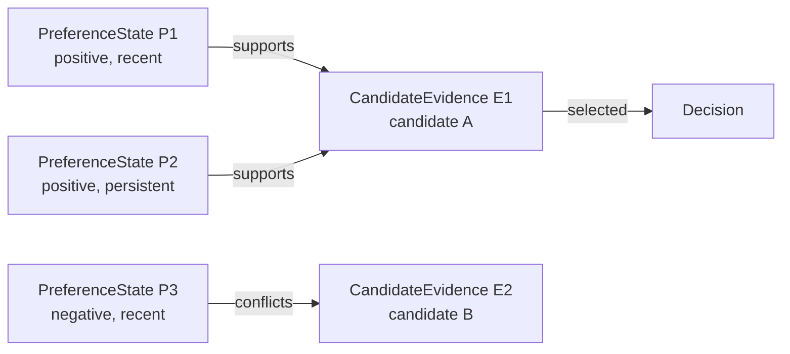

# TRACE-Rec V1 Graph Schema Spec

Date: `2026-04-22`

## 🎯 Design Goal

Define a graph that is:

1. recommendation-specific
2. candidate-conditioned
3. evidence-grounded
4. simple enough to generate, parse, validate, and evaluate

This spec intentionally rejects the larger schema from the early blueprint. The earlier version was expressive, but too expensive to supervise and too easy to overfit into a decorative explanation layer.

## Why V1 Must Be Smaller

Existing work already shows that recommendation reasoning can benefit from:

- free-form CoT and rationale generation
- structured decomposition of preference signals
- candidate-aware or path-aware reasoning
- explicit-to-implicit reasoning transfer

But those papers also imply a practical lesson:

`if the reasoning object is too large, it becomes hard to trust, hard to transfer, and hard to evaluate`

This is especially relevant given the current literature:

- `GOT4Rec` shows that decomposing reasoning sources is useful, but it does not mean every source should become a distinct node type.
- `R2Rec` and similar path-style methods suggest that candidate-conditioned evidence matters more than ontology-rich node taxonomies.
- `SCoTER` implies structure must be stable and compact enough to transfer.
- `SIREN` and `LatentR3` imply that explicit reasoning can become a deployment burden if it is too long or too fine-grained.

So V1 should optimize for:

- sparse structure
- easy validation
- easy counterfactual testing

## 🧭 Simplification Rules

Use these rules when deciding whether a concept deserves its own node type.

### Rule 1

If a concept can be represented as a node attribute, do not make it a node.

### Rule 2

If a concept can be represented as an edge sign or edge label, do not make it a node.

### Rule 3

If a concept cannot be validated automatically in the first prototype, keep it out of V1.

### Rule 4

If two node types differ only by time scale or polarity, merge them and express the difference as attributes.

## 🪓 Keep / Merge / Drop

| Early concept | V1 decision | Reason |
| --- | --- | --- |
| `goal` | merge into graph-level metadata | next-item recommendation usually has a fixed task goal; a dedicated node adds little value in V1 |
| `short_term_interest` | merge into `preference_state.horizon=recent` | time scale is an attribute, not a separate semantic class |
| `long_term_interest` | merge into `preference_state.horizon=persistent` | same reason |
| `aversion` | merge into `preference_state.polarity=negative` | negative evidence is better treated as polarity than as a peer node type |
| `temporal_shift` | drop as explicit node; express via evidence order or optional flag | too abstract and hard to annotate reliably in V1 |
| `candidate_evidence` | keep as a first-class node | candidate-conditioned evidence is the core trace unit in the simplified graph |
| `decision` | keep | needed as a terminal node for derivability and evaluation |

## ✅ Final V1 Schema

TRACE-Rec V1 uses:

- `3` node types
- `3` edge types
- a small number of required attributes

The core shape is:

`preference_state -> candidate_evidence -> decision`

## Graph-Level Metadata

The graph should carry:

- `task`: fixed as `next_item_recommendation`
- `user_id`
- `candidate_ids`
- optional `context`, preferably with evidence registries such as:
  - `available_evidence_refs`
  - `available_feature_refs_by_candidate`

This replaces the earlier `goal` node.

## Node Types

### 1. `preference_state`

Meaning:

A user-side signal grounded in history or side information.

Required attributes:

- `id`
- `type = preference_state`
- `summary`
- `polarity`: `positive` or `negative`
- `horizon`: `recent` or `persistent`
- `evidence_refs`: one reference into user history or user-side context in strict V1 mode
- `source`: `history`, `context`, or `constraint`

Examples:

- recent positive preference for sci-fi
- persistent positive preference for story-rich games
- recent negative preference for horror

### 2. `candidate_evidence`

Meaning:

A candidate-conditioned evidence unit for one item under consideration.

Required attributes:

- `id`
- `type = candidate_evidence`
- `candidate_id`
- `feature_refs`: one metadata reference in strict V1 mode
- `summary`

Optional attributes:

- `rank_prior`
- `retrieval_source`

### 3. `decision`

Meaning:

The final recommendation decision.

Required attributes:

- `id`
- `type = decision`
- `selected_item_id`

## Edge Types

### 1. `supports`

From:

`preference_state -> candidate_evidence`

Meaning:

This user-side preference supports the candidate.

Optional edge attributes:

- `strength`: `weak`, `medium`, `strong`
- `reason_span`

### 2. `conflicts`

From:

`preference_state -> candidate_evidence`

Meaning:

This user-side preference argues against the candidate evidence.

### 3. `selected`

From:

`candidate_evidence -> decision`

Meaning:

This candidate is the chosen recommendation.

There should be exactly one `selected` edge in top-1 recommendation mode.

## Mermaid View

## 📏 Sparsity Constraints

V1 should be intentionally small.

Recommended hard limits:

- `1` to `3` preference-state nodes per example
- `2` to `5` candidate-evidence nodes per example
- at most `2` signed edges per candidate-evidence node
- exactly `1` decision node

These limits force the model to expose only the most decision-relevant factors.

## 🔍 Validation Rules

An output graph is valid only if all of the following hold:

1. every node has a valid type
2. every `preference_state` node has at least one `evidence_refs` entry
3. every `candidate_evidence` node belongs to the provided candidate set
4. every signed edge is from `preference_state` to `candidate_evidence`
5. there is exactly one `selected` edge
6. the `selected` candidate matches `decision.selected_item_id`
7. no preference-state node simultaneously both supports and conflicts with the same candidate-evidence node
8. in strict V1 mode, each non-decision node carries exactly one evidence pointer
9. if `metadata.context` provides registries, every `evidence_ref` and `feature_ref` must resolve against them

## ✂️ What V1 Explicitly Does Not Model

V1 does not include:

- a dedicated `goal` node
- a dedicated `temporal_shift` node
- dedicated `short_term_interest` and `long_term_interest` node types
- a dedicated `aversion` node type
- preference-preference edges
- candidate-candidate comparison edges

Those may appear in V2 only if V1 proves insufficient.

## 🧪 Why This Schema Is Better for Evaluation

This smaller schema is easier to evaluate because:

- interventions can be mapped directly to a small number of node or edge changes
- graph updates can be checked automatically
- free-form CoT baselines can be projected into the same coarse structure or a compact eval view for comparison

Most importantly, V1 makes it easier to test whether reasoning changes are:

- local
- directionally correct
- decision-relevant

## Recommendation

Use this V1 schema as the default project target.

Only reintroduce dropped concepts if V1 fails for a specific, measured reason rather than for stylistic completeness.
